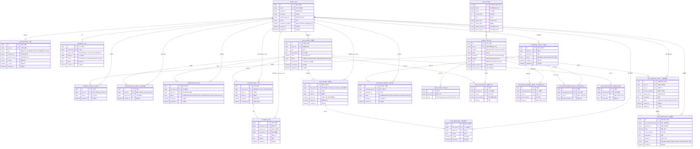

# PocketPick ERD

```mermaid
erDiagram
    %% ===== 회원 / 알림 =====
    USERS ||--o{ NOTIFICATIONS : "알림수신"
    USERS ||--o{ FAVORITE_CARDS : "관심카드"
    USERS ||--o{ FAVORITE_SALE_POSTS : "관심판매글"
    USERS ||--o{ REPORTS : "신고"

    %% ===== 판매 =====
    USERS ||--o{ SALE_POSTS : "판매글작성"
    USERS ||--o{ RESERVATIONS : "예약요청"
    USERS ||--o{ TRANSACTIONS : "거래참여(buyer/seller)"
    USERS ||--o{ REVIEWS : "리뷰작성(reviewer/reviewee)"
    USERS ||--o{ CHAT_ROOMS : "채팅참여(buyer/seller)"
    USERS ||--o{ CHAT_MESSAGES : "메시지발신"

    %% ===== 구매희망 / 교환 =====
    USERS ||--o{ BUY_REQUEST_POSTS : "구매희망글작성"
    USERS ||--o{ SALE_PROPOSALS : "판매제안"
    USERS ||--o{ EXCHANGE_POSTS : "교환글작성"
    USERS ||--o{ EXCHANGE_OFFERS : "교환신청"

    %% ===== 카드 도감 (Pokemon TCG Data 스키마 기준) =====
    SETS ||--o{ CARDS : "수록"
    CARDS ||--o{ CARD_TYPES : "속성(복수)"

    %% ===== 카드 참조 =====
    CARDS ||--o{ SALE_POST_ITEMS : "구성카드"
    CARDS ||--o{ FAVORITE_CARDS : "찜대상"
    CARDS ||--o{ BUY_REQUEST_POSTS : "희망카드"
    CARDS ||--o{ EXCHANGE_OFFERED_ITEMS : "내놓는카드"
    CARDS ||--o{ EXCHANGE_DESIRED_ITEMS : "원하는카드"

    %% ===== 판매글 하위 =====
    SALE_POSTS ||--o{ SALE_POST_ITEMS : "세트구성"
    SALE_POSTS ||--o{ SALE_POST_IMAGES : "이미지"
    SALE_POSTS ||--o{ RESERVATIONS : "예약"
    SALE_POSTS ||--o{ FAVORITE_SALE_POSTS : "찜대상"
    SALE_POSTS ||--o{ CHAT_ROOMS : "채팅문의"
    SALE_POSTS ||--o| TRANSACTIONS : "거래완료"

    %% ===== 채팅 / 거래 / 리뷰 =====
    CHAT_ROOMS ||--o{ CHAT_MESSAGES : "메시지"
    TRANSACTIONS ||--o| REVIEWS : "리뷰"

    %% ===== 구매희망 / 교환 하위 =====
    BUY_REQUEST_POSTS ||--o{ SALE_PROPOSALS : "판매제안"
    EXCHANGE_POSTS ||--o{ EXCHANGE_OFFERED_ITEMS : "내놓는카드"
    EXCHANGE_POSTS ||--o{ EXCHANGE_DESIRED_ITEMS : "원하는카드"
    EXCHANGE_POSTS ||--o{ EXCHANGE_OFFERS : "교환신청"

    USERS["USERS · 회원"] {
        bigint id PK "회원 식별자"
        string email UK "로그인 이메일"
        string password "비밀번호 해시"
        string nickname "닉네임"
        string profile_image_url "프로필 사진 URL"
        string region "지역"
        boolean notification_enabled "알림 전체 ON/OFF(개별설정 없음)"
        datetime created_at "가입일시"
        datetime updated_at "수정일시"
    }

    NOTIFICATIONS["NOTIFICATIONS · 알림"] {
        bigint id PK "알림 식별자"
        bigint user_id FK "수신자(회원)"
        enum type "알림종류(신규판매/예약요청/교환신청/판매제안/수락/거절)"
        bigint reference_id "관련 엔티티 id"
        string reference_type "관련 엔티티 종류"
        string content "알림 내용"
        boolean is_read "읽음 여부"
        datetime created_at "생성일시"
    }

    SETS["SETS · 확장팩"] {
        string id PK "확장팩 코드(예: base1)"
        string name "확장팩명(Base 등)"
        string series "시리즈명"
        int printed_total "인쇄 장수"
        int total "총 장수"
        string ptcgo_code "PTCGO 코드"
        date release_date "발매일"
        string symbol_image_url "심볼 이미지 URL"
        string logo_image_url "로고 이미지 URL"
    }

    CARDS["CARDS · 카드 도감"] {
        bigint id PK "카드 식별자"
        string set_id FK "수록 확장팩(SETS.id)"
        string number "세트 내 카드번호 / UK(set_id,number)"
        string name "카드명"
        enum supertype "카드종류(Pokemon/Trainer/Energy)"
        string subtype "세부종류(Stage2/EX/GX 등)"
        enum rarity "레어도(Common/Rare Holo 등)"
        string image_small_url "도감 이미지(소)"
        string image_large_url "도감 이미지(대)"
    }

    CARD_TYPES["CARD_TYPES · 카드속성"] {
        bigint id PK "식별자"
        bigint card_id FK "대상 카드"
        enum type "속성(Fire/Water/Grass 등), 카드당 복수 가능"
    }

    SALE_POSTS["SALE_POSTS · 판매글"] {
        bigint id PK "판매글 식별자"
        bigint seller_id FK "판매자(회원)"
        string title "제목"
        text description "부가 설명"
        decimal price "세트 전체 가격"
        enum status "상태(SELLING/RESERVED 예약중/COMPLETED 완료)"
        int view_count "조회수(인기순 정렬용)"
        datetime created_at "작성일시"
        datetime updated_at "수정일시"
    }

    SALE_POST_ITEMS["SALE_POST_ITEMS · 판매글 카드"] {
        bigint id PK "식별자"
        bigint sale_post_id FK "소속 판매글"
        bigint card_id FK "카드(도감)"
        enum card_condition "카드상태(카드별)"
        int quantity "수량"
    }

    SALE_POST_IMAGES["SALE_POST_IMAGES · 판매글 이미지"] {
        bigint id PK "식별자"
        bigint sale_post_id FK "소속 판매글"
        string image_url "업로드 이미지 URL"
        int sort_order "정렬 순서"
    }

    RESERVATIONS["RESERVATIONS · 예약"] {
        bigint id PK "예약 식별자"
        bigint sale_post_id FK "대상 판매글"
        bigint buyer_id FK "예약 요청자(구매자)"
        enum status "상태(REQUESTED 요청/ACCEPTED 수락/REJECTED 거절/CANCELLED 취소)"
        datetime created_at "요청일시"
        datetime updated_at "수정일시"
    }

    TRANSACTIONS["TRANSACTIONS · 거래"] {
        bigint id PK "거래 식별자"
        bigint sale_post_id FK "판매글(NULL 허용, 글 자동삭제 대비)"
        bigint buyer_id FK "구매자"
        bigint seller_id FK "판매자"
        decimal final_price "최종 거래가"
        datetime completed_at "거래 완료일시"
    }

    REVIEWS["REVIEWS · 리뷰"] {
        bigint id PK "리뷰 식별자"
        bigint transaction_id FK "대상 거래"
        bigint reviewer_id FK "작성자(구매자)"
        bigint reviewee_id FK "대상(판매자)"
        int rating "평점(1~5)"
        text content "내용"
        datetime created_at "작성일시"
    }

    FAVORITE_CARDS["FAVORITE_CARDS · 관심카드"] {
        bigint id PK "식별자"
        bigint user_id FK "회원 / UK(user_id,card_id)"
        bigint card_id FK "관심 카드"
        datetime created_at "등록일시"
    }

    FAVORITE_SALE_POSTS["FAVORITE_SALE_POSTS · 관심판매글"] {
        bigint id PK "식별자"
        bigint user_id FK "회원 / UK(user_id,sale_post_id)"
        bigint sale_post_id FK "관심 판매글"
        datetime created_at "등록일시"
    }

    CHAT_ROOMS["CHAT_ROOMS · 채팅방"] {
        bigint id PK "채팅방 식별자"
        bigint sale_post_id FK "대상 판매글 / UK(sale_post_id,buyer_id) 중복방지"
        bigint buyer_id FK "구매자"
        bigint seller_id FK "판매자"
        boolean buyer_left "구매자 나감(상대엔 영향X)"
        boolean seller_left "판매자 나감"
        datetime created_at "생성일시"
    }

    CHAT_MESSAGES["CHAT_MESSAGES · 채팅메시지"] {
        bigint id PK "메시지 식별자"
        bigint chat_room_id FK "소속 채팅방"
        bigint sender_id FK "발신자"
        text content "내용"
        boolean is_read "읽음 여부"
        datetime created_at "발신일시"
    }

    REPORTS["REPORTS · 신고"] {
        bigint id PK "신고 식별자"
        bigint reporter_id FK "신고자"
        enum target_type "대상 종류(SALE_POST/USER 등, 폴리모픽)"
        bigint target_id "신고 대상 id"
        enum reason "사유(FRAUD 사기/INAPPROPRIATE 부적절 등)"
        text detail "상세 사유"
        datetime created_at "신고일시"
    }

    BUY_REQUEST_POSTS["BUY_REQUEST_POSTS · 구매희망글"] {
        bigint id PK "구매희망글 식별자"
        bigint buyer_id FK "작성자(구매자)"
        bigint card_id FK "희망 카드"
        enum desired_condition "희망 카드상태"
        decimal desired_price "구매 희망 가격"
        text description "설명"
        enum status "상태(OPEN 모집중/COMPLETED 완료)"
        datetime created_at "작성일시"
        datetime updated_at "수정일시"
    }

    SALE_PROPOSALS["SALE_PROPOSALS · 판매제안"] {
        bigint id PK "판매제안 식별자"
        bigint buy_request_post_id FK "대상 구매희망글"
        bigint proposer_id FK "제안자(판매자)"
        decimal price "제안 가격"
        enum card_condition "카드상태"
        text description "설명"
        string image_url "이미지 URL"
        enum status "상태(PROPOSED 제안/ACCEPTED 수락/REJECTED 거절)"
        datetime created_at "제안일시"
    }

    EXCHANGE_POSTS["EXCHANGE_POSTS · 교환글"] {
        bigint id PK "교환글 식별자"
        bigint owner_id FK "작성자"
        text description "설명"
        enum status "상태(OPEN 모집중/COMPLETED 완료)"
        datetime created_at "작성일시"
        datetime updated_at "수정일시"
    }

    EXCHANGE_OFFERED_ITEMS["EXCHANGE_OFFERED_ITEMS · 교환 내놓는카드"] {
        bigint id PK "식별자"
        bigint exchange_post_id FK "소속 교환글"
        bigint card_id FK "내놓는 카드"
        enum card_condition "카드상태"
        string image_url "업로드 이미지 URL"
    }

    EXCHANGE_DESIRED_ITEMS["EXCHANGE_DESIRED_ITEMS · 교환 원하는카드"] {
        bigint id PK "식별자"
        bigint exchange_post_id FK "소속 교환글"
        bigint card_id FK "원하는 카드(선택)"
        enum desired_condition "희망 상태"
    }

    EXCHANGE_OFFERS["EXCHANGE_OFFERS · 교환신청"] {
        bigint id PK "교환신청 식별자"
        bigint exchange_post_id FK "대상 교환글"
        bigint requester_id FK "신청자"
        enum status "상태(REQUESTED 요청/ACCEPTED 수락/REJECTED 거절)"
        text message "신청 메시지"
        datetime created_at "신청일시"
    }
```
