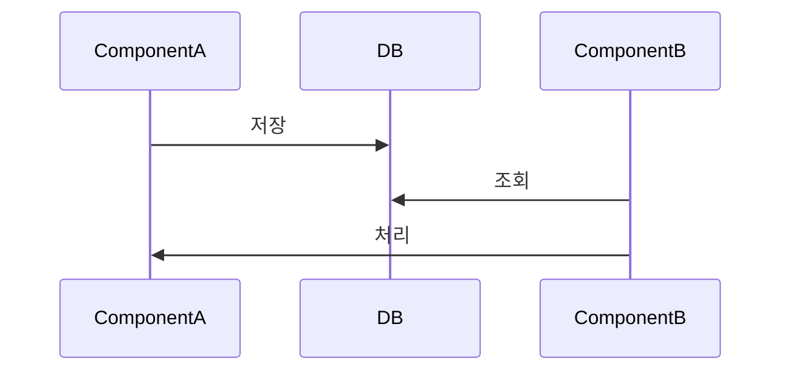

# Git 컨벤션 — PocketPick

> LINE, 카카오, Atlassian 실무 사례 기반

---

## 1. 브랜치 전략

```
main ← feat/, fix/, hotfix/, refactor/, chore/, docs/, test/, style/, ci/
```

| 브랜치 | 용도 | 머지 대상 |
|--------|------|----------|
| `main` | 항상 배포 가능 상태 유지 | - |
| `feat/*` | 기능 개발 | `main` |
| `fix/*` | 버그 수정 | `main` |
| `hotfix/*` | 프로덕션 긴급 패치 | `main` |

**흐름**
```
main에서 분기
  → feat/SCRUM-번호-설명 작업
  → PR → main으로 머지
```

---

## 2. 브랜치 명명 규칙

```
<type>/<TICKET-ID>-<짧은-설명>
```

| 타입 | 용도 |
|------|------|
| `feat` | 새 기능 |
| `fix` | 버그 수정 |
| `hotfix` | 프로덕션 긴급 수정 |
| `refactor` | 기능 변경 없는 코드 개선 |
| `chore` | 빌드/설정/의존성 변경 |
| `docs` | 문서 |
| `test` | 테스트 추가/수정 |
| `style` | 포맷, 공백 등 (로직 변경 없음) |
| `ci` | CI/CD 파이프라인 변경 |

**예시**
```
feat/SCRUM-12-jwt-login-api
fix/SCRUM-34-payment-null-pointer
hotfix/SCRUM-55-token-expiry-crash
refactor/SCRUM-56-user-service-solid
chore/SCRUM-78-spring-boot-upgrade
ci/SCRUM-90-github-actions-setup
```

**원칙**
- 티켓 번호 필수 → Jira 자동 연동
- 설명은 소문자 + 하이픈, 최대 5단어
- 작업 전 반드시 `main` 최신화 후 분기

---

## 3. 커밋 메시지

```
<type>: <설명> (SCRUM-번호)
```

| 타입 | 용도 |
|------|------|
| `feat` | 새 기능 추가 |
| `fix` | 버그 수정 |
| `refactor` | 리팩터링 |
| `chore` | 빌드/설정 변경 |
| `docs` | 문서 수정 |
| `test` | 테스트 추가/수정 |
| `style` | 포맷, 공백 (로직 변경 없음) |
| `ci` | CI/CD 변경 |

**예시**
```
feat: JWT 토큰 발급 API 구현 (SCRUM-12)
fix: PaymentService 널 포인터 수정 (SCRUM-34)
refactor: UserService 생성자 주입으로 변경 (SCRUM-56)
chore: Spring Boot 3.3.0으로 업그레이드 (SCRUM-78)
test: CardService 단위 테스트 추가 (SCRUM-91)
```

**원칙**
- 제목 50자 이내
- 본문이 필요하면 빈 줄 후 작성 — what이 아닌 **why** 중심
- WIP 커밋은 PR 전 squash 정리

---

## 4. PR 규칙

### 제목
커밋 메시지 형식과 동일
```
feat: JWT 토큰 발급 API 구현 (SCRUM-12)
```

### PR 설명 템플릿

````markdown
## 관련 티켓
- SCRUM-12: https://pocketpick1.atlassian.net/browse/SCRUM-12

## Summary

- (변경 사항 bullet point로 요약)
- (추가된 클래스/테이블/스케줄러 등)
- (기존 코드에서 바뀐 핵심 부분)

## ~흐름 (어떤 흐름인지 적어)



## Before / After 비교 (기능 추가면 사용 X)

| 상황 | Before | After |
|------|--------|-------|
| 케이스 1 | 기존 동작 | 변경 후 동작 |
| 케이스 2 | 기존 동작 | 변경 후 동작 |

## 검증 결과

로컬에서 직접 확인한 내용:
1. (확인 항목 1)
2. (확인 항목 2)

## 범위 외

(이번 PR에서 의도적으로 다루지 않은 것 — 없으면 생략)

## Test plan

- [x] (완료된 테스트)
- [ ] (미완료 테스트, 이유 명시)

closes SCRUM-N
````

---

## 5. 셀프 리뷰 기준

PR 올리기 전 스스로 확인할 것:

| 항목 | 체크 포인트 |
|------|------------|
| **정확성** | 티켓의 완료 기준(DoD)을 모두 충족하는가 |
| **SOLID** | 단일 책임, 의존성 역전 등 설계 원칙 준수 |
| **컨벤션** | CLAUDE.md 코딩 컨벤션 준수 (생성자 주입, DTO 변환 등) |
| **테스트** | 핵심 로직에 테스트가 있는가 |
| **보안** | 시크릿 하드코딩, SQL 인젝션 등 OWASP 위험 없는가 |
| **성능** | N+1 쿼리, EAGER 로딩 등 명백한 성능 문제 없는가 |

### 코멘트 레벨 (멘토/팀원 리뷰 시)

```
[blocking] 머지 전 반드시 수정
[suggestion] 수정 권고, 작성자 판단
[nit] 사소한 스타일, 무시 가능
[question] 이해를 위한 질문, 수정 불필요
```

**예시**
```
[blocking] Optional.orElse(null) 사용 금지 → orElseThrow()로 변경
[suggestion] 이 로직은 도메인 객체 안으로 옮기는 게 자연스러울 것 같아요
[nit] 빈 줄 하나 제거해도 될 것 같아요
[question] 여기서 트랜잭션 범위를 이렇게 잡은 이유가 있나요?
```

